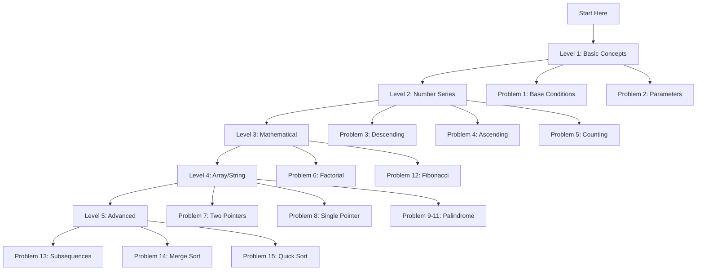

# 🚀 DSA Notes by Dmeel

> **Mastering Data Structures & Algorithms through Comprehensive Recursion Fundamentals**

---

## 📚 Table of Contents

- [🎯 Overview](#-overview)
- [📖 Problem Index](#-problem-index)
- [🎓 Learning Path](#-learning-path)
- [⚡ Quick Reference](#-quick-reference)
- [🔧 Prerequisites](#-prerequisites)
- [📈 Progress Tracking](#-progress-tracking)
- [💡 Tips & Tricks](#-tips--tricks)
- [🎉 Completion Checklist](#-completion-checklist)

---

## 🎯 Overview

Welcome to **DSA Notes by Dmeel** - your comprehensive guide to mastering recursion fundamentals! This repository contains detailed notes, step-by-step solutions, and visual explanations for 15 essential recursion problems that form the foundation of algorithmic thinking.

### 🌟 What You'll Learn

- **Recursion Fundamentals**: Base cases, recursive calls, call stack visualization
- **Problem-Solving Patterns**: Choice-based, accumulator, tail recursion
- **Optimization Techniques**: Memoization, space optimization, algorithm comparison
- **Complexity Analysis**: Time and space complexity for recursive algorithms
- **Real-World Applications**: Practical uses of recursion in software development

---

## �� Problem Index

### 📋 **05_Basics_of_Recursion**

| #   | Problem Statement                                                                                                                                                           | Difficulty Level | Key Topics                                                              |
| --- | --------------------------------------------------------------------------------------------------------------------------------------------------------------------------- | ---------------- | ----------------------------------------------------------------------- |
| 1   | [Demonstrate the fundamental concept of recursion using a simple counter that prints numbers from 1 to 5 using a global variable and base condition](p1_basic_recursion.md) | ⭐ Beginner      | Base conditions, call stack, global variables                           |
| 2   | [Print a given string "Hello" exactly N times using recursion with parameter-based approach](p2_print_n_times.md)                                                           | ⭐ Beginner      | Parameter-based recursion, tail recursion                               |
| 3   | [Print numbers from N down to 1 using recursion with pre-order processing](p3_print_descending.md)                                                                          | ⭐⭐ Easy        | Tail recursion, pre-order recursion, descending order                   |
| 4   | [Print numbers from 1 to N in ascending order using post-order recursion](p4_print_ascending.md)                                                                            | ⭐⭐ Easy        | Post-order recursion, stack-based processing, ascending order           |
| 5   | [Count from 1 to N using recursion with accumulator pattern](p5_count_recursion.md)                                                                                         | ⭐⭐ Easy        | Accumulator pattern, parameter passing, state management                |
| 6   | [Calculate the factorial of a number using mathematical recursion](p6_factorial.md)                                                                                         | ⭐⭐ Easy        | Mathematical recursion, base case handling, recursion tree              |
| 7   | [Reverse an array using recursion with two-pointer technique](p7_reverse_array_two_pointers.md)                                                                             | ⭐⭐⭐ Medium    | Two-pointer technique, in-place algorithms, array manipulation          |
| 8   | [Reverse an array using recursion with single-pointer optimization](p8_reverse_array_single_pointer.md)                                                                     | ⭐⭐⭐ Medium    | Single pointer optimization, space efficiency, mirror index calculation |
| 9   | [Check if a given string is a palindrome using iterative two-pointer approach](p9_palindrome_iterative.md)                                                                  | ⭐⭐ Easy        | Two-pointer technique, string validation, iterative approach            |
| 10  | [Check if a given string is a palindrome using recursion with two pointers](p10_palindrome_recursive.md)                                                                    | ⭐⭐ Easy        | Two-pointer recursion, string validation, recursive approach            |
| 11  | [Check if a given string is a palindrome using recursion with single pointer optimization](p11_palindrome_optimized.md)                                                     | ⭐⭐ Easy        | Single pointer recursion, mirror index calculation, optimization        |
| 12  | [Calculate the Nth Fibonacci number using recursion with memoization](p12_fibonacci_memoization.md)                                                                         | ⭐⭐⭐ Medium    | Dynamic programming, memoization, overlapping subproblems               |
| 13  | [Print all subsequences of a given string using choice-based recursion](p13_subsequence_notes.md)                                                                           | ⭐⭐⭐⭐ Hard    | Choice-based recursion, complete enumeration, binary decision tree      |
| 14  | [Implement Merge Sort algorithm using divide-and-conquer recursion](p14_merge_sort.md)                                                                                      | ⭐⭐⭐ Medium    | Divide-and-conquer, stable sorting, O(n log n) complexity               |
| 15  | [Implement Quick Sort algorithm using divide-and-conquer recursion](p15_quick_sort.md)                                                                                      | ⭐⭐⭐ Medium    | Divide-and-conquer, partition, in-place sorting, O(n log n) average     |

---

## 🎓 Learning Path

### 📈 **Recommended Study Order**



### 🎯 **Learning Objectives by Level**

#### **Level 1: Foundation** 🏗️

- Understand recursion basics
- Master base conditions
- Learn call stack visualization

#### **Level 2: Patterns** 📊

- Master different recursion patterns
- Understand parameter passing
- Learn accumulator techniques

#### **Level 3: Mathematics** 🧮

- Apply recursion to mathematical problems
- Learn dynamic programming basics
- Understand optimization techniques

#### **Level 4: Data Structures** 🔄

- Manipulate arrays and strings recursively
- Master pointer techniques
- Learn space optimization

#### **Level 5: Advanced** 🎯

- Solve complex recursive problems
- Master choice-based recursion
- Understand complete enumeration

---

## ⚡ Quick Reference

### 🔑 **Key Recursion Patterns**

| Pattern            | Description                      | Example Problems |
| ------------------ | -------------------------------- | ---------------- |
| **Tail Recursion** | Recursive call is last operation | P3, P5           |
| **Post-order**     | Process after recursive call     | P4               |
| **Pre-order**      | Process before recursive call    | P3               |
| **Choice-based**   | Multiple recursive paths         | P13              |
| **Accumulator**    | Pass result as parameter         | P5               |

### 📊 **Complexity Cheat Sheet**

| Problem Type     | Time Complexity | Space Complexity |
| ---------------- | --------------- | ---------------- |
| Simple Recursion | O(n)            | O(n)             |
| Tail Recursion   | O(n)            | O(n)             |
| Memoization      | O(n)            | O(n)             |
| Choice-based     | O(2^n)          | O(n)             |

### 🎯 **Common Base Cases**

```java
// Numeric base cases
if (n <= 0) return 0;
if (n == 1) return 1;

// Array base cases
if (i >= j) return;
if (i >= arr.length/2) return;

// String base cases
if (s.length() == 0) return false;
if (i >= s.length()/2) return true;
```

---

## 🔧 Prerequisites

### 📚 **Required Knowledge**

- ✅ Basic Java programming
- ✅ Understanding of arrays and strings
- ✅ Familiarity with loops and conditionals
- ✅ Basic mathematical concepts

### 🛠️ **Tools & Environment**

- ✅ Java Development Kit (JDK)
- ✅ Any Java IDE (IntelliJ, Eclipse, VS Code)
- ✅ Git for version control (optional)

### 📖 **Recommended Reading**

- "Introduction to Algorithms" by CLRS
- "Grokking Algorithms" by Aditya Bhargava
- Online platforms: LeetCode, HackerRank

---

## 📈 Progress Tracking

### 🎯 **Track Your Progress**

Copy this template and mark your progress:

```markdown
## My Progress Tracker

### Level 1: Basic Concepts

- [ ] Problem 1: Basic Recursion with Base Condition
- [ ] Problem 2: Print String N Times

### Level 2: Number Series & Counting

- [ ] Problem 3: Print N to 1 (Descending)
- [ ] Problem 4: Print 1 to N (Ascending)
- [ ] Problem 5: Count 1 to N

### Level 3: Mathematical Problems

- [ ] Problem 6: Factorial Using Recursion
- [ ] Problem 12: Fibonacci with Memoization

### Level 4: Array & String Manipulation

- [ ] Problem 7: Reverse Array (Two Pointers)
- [ ] Problem 8: Reverse Array (Single Pointer)
- [ ] Problem 9: Check Palindrome (Iterative)
- [ ] Problem 10: Check Palindrome (Recursive)
- [ ] Problem 11: Check Palindrome (Optimized)

### Level 5: Advanced Recursion

- [ ] Problem 13: Print All Subsequences
- [ ] Problem 14: Merge Sort Algorithm
```

### 📊 **Performance Metrics**

Track your understanding with these metrics:

- **Conceptual Understanding**: Can you explain the recursion tree?
- **Implementation**: Can you code it from scratch?
- **Optimization**: Can you identify better approaches?
- **Application**: Can you apply to similar problems?

---

## 💡 Tips & Tricks

### 🧠 **Mental Models**

1. **Think Recursively**: Break problems into smaller subproblems
2. **Visualize the Stack**: Draw the call stack for complex problems
3. **Identify Patterns**: Look for common recursion patterns
4. **Test Edge Cases**: Always test with base cases and edge cases

### 🚀 **Optimization Strategies**

1. **Tail Recursion**: Convert to iterative when possible
2. **Memoization**: Cache results for repeated subproblems
3. **Space Optimization**: Reduce parameter count
4. **Early Exit**: Return early when possible

### 🐛 **Common Pitfalls**

1. **Missing Base Case**: Always define stopping condition
2. **Infinite Recursion**: Ensure recursive calls approach base case
3. **Stack Overflow**: Be mindful of recursion depth
4. **Wrong Return Type**: Match return types with function signature

### 🎯 **Problem-Solving Framework**

1. **Understand**: Read and understand the problem
2. **Plan**: Identify base case and recursive case
3. **Code**: Implement the solution
4. **Test**: Test with various inputs
5. **Optimize**: Look for improvements

---

## 🎉 Completion Checklist

### ✅ **Before Moving to Next Level**

- [ ] All problems in current level completed
- [ ] Can explain recursion tree for each problem
- [ ] Can implement from memory
- [ ] Understand time and space complexity
- [ ] Can identify similar problems
- [ ] Can optimize the solution

### 🏆 **Final Assessment**

- [ ] All 13 problems completed
- [ ] Can solve new recursion problems independently
- [ ] Understand when to use recursion vs iteration
- [ ] Can apply recursion to real-world problems
- [ ] Ready for advanced DSA topics

---

## 🤝 Contributing

Found an error or want to improve the notes? Here's how you can contribute:

1. **Report Issues**: Create an issue for bugs or improvements
2. **Suggest Enhancements**: Propose new problems or explanations
3. **Share Solutions**: Submit alternative approaches
4. **Improve Documentation**: Help make notes clearer

---

## 📞 Support & Community

- **Questions**: Create an issue for clarifications
- **Discussions**: Share your learning journey
- **Feedback**: Help improve the learning experience

---

## 🎓 About the Author

**Dmeel** - A passionate learner and educator in the field of Data Structures and Algorithms. This repository represents a comprehensive approach to mastering recursion fundamentals through detailed explanations, visual aids, and practical examples.

---

<div align="center">

### 🌟 **Happy Learning!** 🌟

_"The only way to learn a new programming language is by writing programs in it."_ - Dennis Ritchie

</div>

---

**Last Updated**: December 2024  
**Version**: 1.1  
**Total Problems**: 14  
**Completion Status**: ✅ Complete
