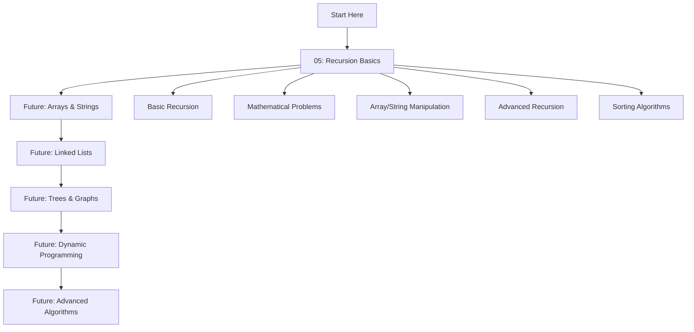

# 🚀 DSA Learning Repository by Dmeel

> **Comprehensive Data Structures & Algorithms Learning Path with Practical Implementations**

---

## 📚 Repository Overview

Welcome to the **DSA Learning Repository** - your complete guide to mastering Data Structures and Algorithms through hands-on practice and detailed explanations. This repository is designed to take you from basic concepts to advanced algorithmic thinking.

### 🌟 What You'll Find Here

- **📖 Detailed Theory**: Comprehensive explanations with visual aids
- **💻 Practical Implementations**: Complete code solutions in Java
- **🎯 Problem-Solving Approach**: Step-by-step problem-solving methodology
- **📊 Complexity Analysis**: Time and space complexity explanations
- **🧪 Testing & Verification**: Multiple test cases and edge cases
- **🚀 Optimization Techniques**: Performance improvement strategies

---

## 📋 Table of Contents

- [🎯 Learning Path](#-learning-path)
- [📁 Practical Index](#-practical-index)
- [🎓 Prerequisites](#-prerequisites)
- [🛠️ Setup & Environment](#️-setup--environment)
- [📈 Progress Tracking](#-progress-tracking)
- [💡 Learning Tips](#-learning-tips)
- [🤝 Contributing](#-contributing)
- [📞 Support](#-support)

---

## 🎯 Learning Path

### 📈 **Recommended Study Order**



### 🎓 **Learning Objectives by Module**

#### **Module 1: Recursion Fundamentals** 🧠
- Master recursive thinking and problem decomposition
- Understand base cases and recursive cases
- Learn different recursion patterns (tail, post-order, choice-based)
- Implement mathematical and algorithmic problems recursively

#### **Future Modules** 🔮
- **Arrays & Strings**: Two-pointer techniques, sliding window
- **Linked Lists**: Fast/slow pointers, reversal techniques
- **Trees & Graphs**: DFS, BFS, traversal algorithms
- **Dynamic Programming**: Memoization, tabulation, optimization
- **Advanced Algorithms**: Greedy, backtracking, advanced data structures

---

## 📁 Practical Index

### 🔄 **05_Basics_of_Recursion** (14 Problems)

> **Master the foundation of algorithmic thinking through recursion**

| # | Problem | Difficulty | Key Topics | Status |
|---|---------|------------|------------|--------|
| 1 | [Basic Recursion with Base Condition](05_basics_of_recursion/p1_basic_recursion.md) | ⭐ Beginner | Base conditions, call stack | ✅ Complete |
| 2 | [Print String N Times](05_basics_of_recursion/p2_print_n_times.md) | ⭐ Beginner | Parameter-based recursion | ✅ Complete |
| 3 | [Print N to 1 (Descending)](05_basics_of_recursion/p3_print_descending.md) | ⭐⭐ Easy | Tail recursion, pre-order | ✅ Complete |
| 4 | [Print 1 to N (Ascending)](05_basics_of_recursion/p4_print_ascending.md) | ⭐⭐ Easy | Post-order recursion | ✅ Complete |
| 5 | [Count 1 to N](05_basics_of_recursion/p5_count_recursion.md) | ⭐⭐ Easy | Accumulator pattern | ✅ Complete |
| 6 | [Factorial Using Recursion](05_basics_of_recursion/p6_factorial.md) | ⭐⭐ Easy | Mathematical recursion | ✅ Complete |
| 7 | [Reverse Array (Two Pointers)](05_basics_of_recursion/p7_reverse_array_two_pointers.md) | ⭐⭐⭐ Medium | Two-pointer technique | ✅ Complete |
| 8 | [Reverse Array (Single Pointer)](05_basics_of_recursion/p8_reverse_array_single_pointer.md) | ⭐⭐⭐ Medium | Single pointer optimization | ✅ Complete |
| 9 | [Check Palindrome (Iterative)](05_basics_of_recursion/p9_palindrome_iterative.md) | ⭐⭐ Easy | Two-pointer technique | ✅ Complete |
| 10 | [Check Palindrome (Recursive)](05_basics_of_recursion/p10_palindrome_recursive.md) | ⭐⭐ Easy | Two-pointer recursion | ✅ Complete |
| 11 | [Check Palindrome (Optimized)](05_basics_of_recursion/p11_palindrome_optimized.md) | ⭐⭐ Easy | Single pointer recursion | ✅ Complete |
| 12 | [Fibonacci with Memoization](05_basics_of_recursion/p12_fibonacci_memoization.md) | ⭐⭐⭐ Medium | Dynamic programming | ✅ Complete |
| 13 | [Print All Subsequences](05_basics_of_recursion/p13_subsequence_notes.md) | ⭐⭐⭐⭐ Hard | Choice-based recursion | ✅ Complete |
| 14 | [Merge Sort Algorithm](05_basics_of_recursion/p14_merge_sort.md) | ⭐⭐⭐ Medium | Divide-and-conquer | ✅ Complete |
| 15 | [Quick Sort Algorithm](05_basics_of_recursion/p15_quick_sort.md) | ⭐⭐⭐ Medium | Divide-and-conquer, Partition | ✅ Complete |

**📊 Module Statistics:**
- **Total Problems**: 15
- **Completion Rate**: 100%
- **Difficulty Distribution**: 4 Beginner, 6 Easy, 4 Medium, 1 Hard
- **Key Concepts**: Recursion, Divide-and-Conquer, Dynamic Programming, Sorting

---

## 🎓 Prerequisites

### 📚 **Required Knowledge**

- ✅ **Basic Programming**: Understanding of variables, loops, conditionals
- ✅ **Java Fundamentals**: Classes, methods, arrays, strings
- ✅ **Mathematical Thinking**: Basic algebra and logic
- ✅ **Problem-Solving**: Ability to break down problems

### 🛠️ **Recommended Tools**

- **IDE**: IntelliJ IDEA, Eclipse, or VS Code with Java extensions
- **Version Control**: Git for tracking progress
- **Documentation**: Keep a learning journal
- **Practice Platform**: LeetCode, HackerRank for additional practice

---

## 🛠️ Setup & Environment

### 🔧 **Getting Started**

1. **Clone the Repository**
   ```bash
   git clone <repository-url>
   cd DSA
   ```

2. **Setup Java Environment**
   ```bash
   # Verify Java installation
   java -version
   javac -version
   ```

3. **Compile and Run**
   ```bash
   # Navigate to specific problem
   cd 05_basics_of_recursion
   
   # Compile Java file
   javac p1.java
   
   # Run the program
   java p1
   ```

### 📁 **Project Structure**

```
DSA/
├── 05_basics_of_recursion/
│   ├── README.md                 # Module overview and navigation
│   ├── p1_basic_recursion.md     # Problem documentation
│   ├── p1.java                   # Implementation
│   ├── p2_print_n_times.md
│   ├── p2.java
│   └── ... (14 problems total)
├── README.md                     # This file - main index
└── .gitignore
```

---

## 📈 Progress Tracking

### 🎯 **Personal Progress Tracker**

Copy this template to track your learning journey:

```markdown
## My DSA Learning Progress

### ✅ Completed Modules
- [x] 05_Basics_of_Recursion (15/15 problems)

### 🔄 Current Module
- [ ] 06_Arrays_and_Strings (Coming Soon)

### 📊 Statistics
- **Total Problems Solved**: 15
- **Current Streak**: 0 days
- **Favorite Problem**: [Your choice]
- **Biggest Challenge**: [Your reflection]

### 🎯 Goals
- [ ] Complete all recursion problems
- [ ] Understand time/space complexity
- [ ] Implement from memory
- [ ] Apply to new problems
```

### 📊 **Performance Metrics**

Track these key metrics for each problem:

| Metric | Description | Target |
|--------|-------------|--------|
| **Understanding** | Can explain the algorithm | 100% |
| **Implementation** | Can code from scratch | 100% |
| **Optimization** | Can identify improvements | 80% |
| **Application** | Can solve similar problems | 90% |

---

## 💡 Learning Tips

### 🧠 **Effective Learning Strategies**

1. **🎯 Problem-Solving Framework**
   - Understand the problem completely
   - Plan your approach before coding
   - Implement step by step
   - Test with multiple cases
   - Analyze complexity

2. **📚 Study Techniques**
   - **Active Learning**: Don't just read, implement
   - **Spaced Repetition**: Review problems regularly
   - **Teach Others**: Explain concepts to reinforce learning
   - **Practice Daily**: Consistency beats intensity

3. **🚀 Optimization Mindset**
   - Always consider time and space complexity
   - Look for patterns and similarities
   - Question if there's a better approach
   - Learn from multiple solutions

### 🎯 **Common Pitfalls to Avoid**

1. **❌ Rushing to Code**: Plan first, code later
2. **❌ Ignoring Edge Cases**: Test thoroughly
3. **❌ Memorizing Solutions**: Understand the logic
4. **❌ Skipping Complexity Analysis**: Always analyze performance
5. **❌ Not Practicing Enough**: Theory without practice is incomplete

### 🎉 **Success Indicators**

You're on the right track when you can:
- ✅ Explain any algorithm in your own words
- ✅ Implement solutions from memory
- ✅ Identify similar problems quickly
- ✅ Optimize solutions independently
- ✅ Apply concepts to new problems

---

## 🤝 Contributing

### 🎯 **How to Contribute**

1. **Report Issues**: Found a bug or unclear explanation?
2. **Suggest Improvements**: Better approaches or optimizations?
3. **Add Problems**: New interesting problems to solve?
4. **Improve Documentation**: Make explanations clearer?

### 📝 **Contribution Guidelines**

- **Code Quality**: Follow Java best practices
- **Documentation**: Clear explanations with examples
- **Testing**: Include multiple test cases
- **Complexity Analysis**: Always include time/space analysis

---

## 📞 Support

### 🆘 **Getting Help**

- **Questions**: Create an issue for clarifications
- **Discussions**: Share your learning journey
- **Feedback**: Help improve the learning experience

### 🌟 **Community**

- **Study Groups**: Form study groups with peers
- **Code Reviews**: Review each other's solutions
- **Knowledge Sharing**: Share insights and tips

---

## 🎓 About the Author

**Dmeel** - A passionate learner and educator in Data Structures and Algorithms. This repository represents a comprehensive approach to mastering DSA through:

- **Detailed Explanations**: Step-by-step problem-solving approach
- **Visual Learning**: Diagrams and flowcharts for complex concepts
- **Practical Implementation**: Complete working code solutions
- **Progressive Difficulty**: From basics to advanced concepts

### 🎯 **Learning Philosophy**

> *"The best way to learn algorithms is to implement them, understand them, and then apply them to new problems. This repository is designed to guide you through that journey."*

---

## 📊 Repository Statistics

| Metric | Value |
|--------|-------|
| **Total Modules** | 1 (Active) |
| **Total Problems** | 15 |
| **Lines of Code** | 600+ |
| **Documentation Pages** | 16 |
| **Last Updated** | December 2024 |

---

## 🚀 What's Next?

### 🔮 **Upcoming Modules**

- **06_Arrays_and_Strings**: Two-pointer techniques, sliding window
- **07_Linked_Lists**: Fast/slow pointers, reversal algorithms
- **08_Trees_and_Graphs**: DFS, BFS, traversal techniques
- **09_Dynamic_Programming**: Memoization, tabulation, optimization
- **10_Advanced_Algorithms**: Greedy, backtracking, advanced DS

### 🎯 **Learning Goals**

- Master fundamental DSA concepts
- Develop strong problem-solving skills
- Build confidence in algorithmic thinking
- Prepare for technical interviews
- Apply knowledge to real-world problems

---

<div align="center">

### 🌟 **Start Your DSA Journey Today!** 🌟

_"The only way to learn a new programming language is by writing programs in it."_ - Dennis Ritchie

**Begin with [Recursion Basics](05_basics_of_recursion/README.md) and build your foundation!**

</div>

---

**Repository Version**: 1.0  
**Last Updated**: December 2024  
**Total Problems**: 14  
**Status**: �� Active Development 